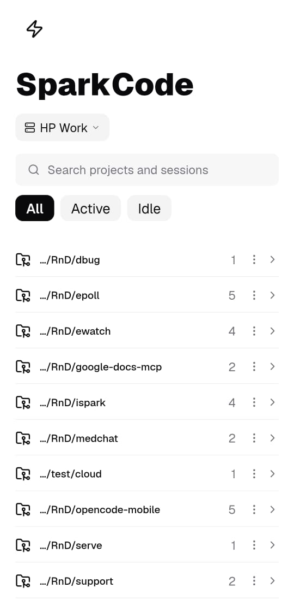
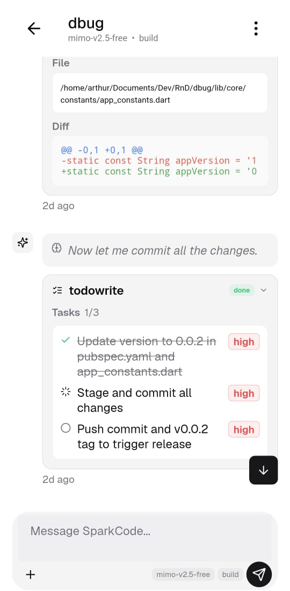
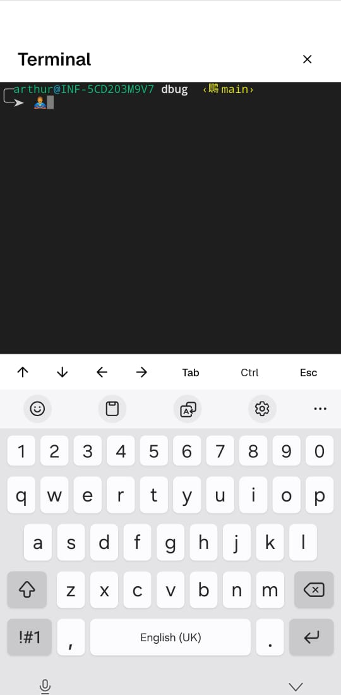

# Spark

**Spark** is a Flutter mobile app (Android/iOS) that acts as a remote client for a
running [`opencode serve`](https://opencode.ai/docs/server/) HTTP server. From your
phone you can browse sessions, chat with the AI (with live streaming), approve
permission requests, switch models/agents, browse project files and diffs, and
even access a full terminal.

In the UI the backend is branded as **SparkCode**, but underneath it is still the
standard opencode server API.

## Screenshots

| Home | Chat | Terminal |
|------|------|----------|
|  |  |  |

## Features

- Connect to one or more opencode servers (host/port, optional HTTP Basic auth).
- Session list grouped by project/worktree, with search and active/idle filters.
- Chat thread with live streaming of text, reasoning, and tool calls.
- Tool-call chips that expand inline to show structured content:
  - `todowrite` → rendered as a checklist with status icons and priority badges.
  - `bash` → command + output; `grep` → pattern/path/results.
  - `read` / `edit` / `write` / `glob` → file paths and diffs.
- Permission approval banner + sheet; optional auto-approve toggle.
- Model and agent pickers sourced from the server config.
- Project-scoped file browser and diff viewer.
- Full terminal with PTY support, keyboard toolbar (arrows, Tab, Ctrl, Esc).
- Local notifications for incoming permission requests.

## Getting Started

This is a Flutter project. You will need the [Flutter SDK](https://docs.flutter.dev/)
(uses the bundled Dart 3.12 toolchain).

```bash
# Install dependencies
flutter pub get

# Static analysis (always run before a commit)
flutter analyze

# Format code
dart format .

# Run the app (needs a device/emulator)
flutter run
```

## Connecting to an opencode server

Start a server for manual testing:

```bash
opencode serve --port 4096
# with auth:
OPENCODE_SERVER_PASSWORD=secret opencode serve --port 4096
```

Then in Spark, open the connection screen (menu → settings) and add a server
pointing at `http://<host>:4096`. The server's default auth username is
`opencode`; the password is the one you set above.

## Branding note

The app is named **Spark** and labels the backend **SparkCode** in user-facing
strings. Internal identifiers tied to the opencode API (`opencodeClientProvider`,
`OpencodeClient`, the `opencode_*` SharedPreferences keys, the default `opencode`
auth username) must **not** be renamed — they are real server API values and
renaming them breaks auth/persistence.

## Project layout

```
lib/
  main.dart              # ShadcnApp root, theme, router, lifecycle refresh
  app/                   # router, theme
  core/                  # api, models, notifications, storage
  features/              # connection, sessions, chat, permissions, models, files, terminal
  shared/widgets/        # markdown, code highlight, sheet helpers
```

State is managed with **flutter_riverpod**; UI uses **shadcn_flutter** (New York
theme, zinc background, cyan accent); networking is **dio** (REST) plus a
hand-parsed SSE stream for `/event`.
